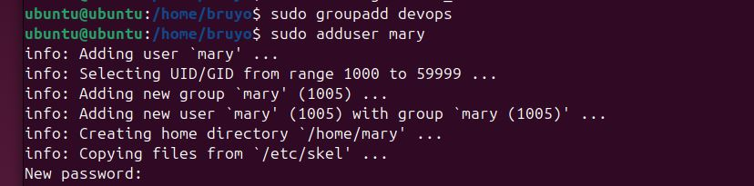
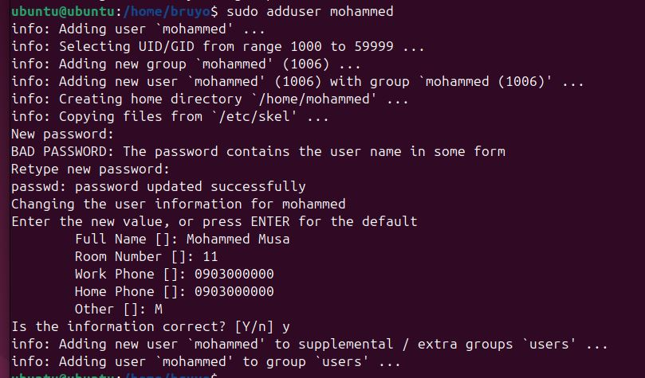
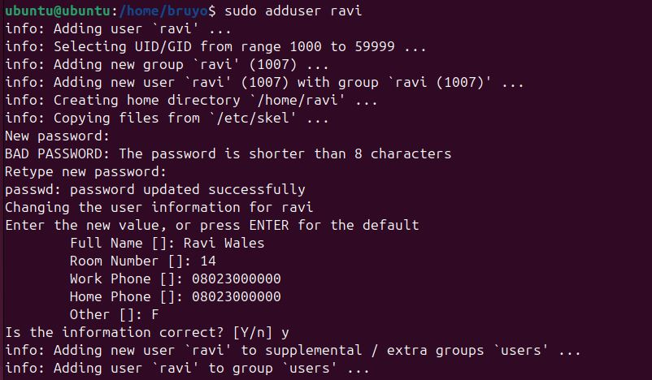
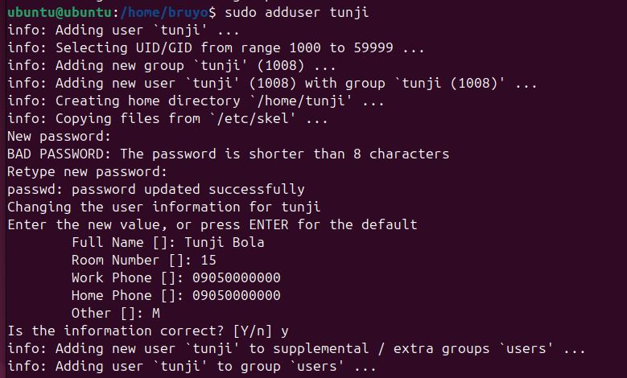
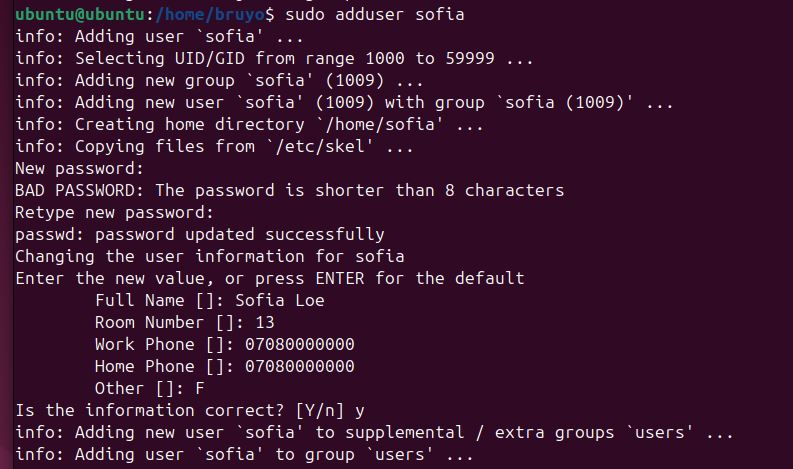
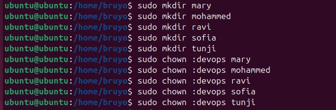
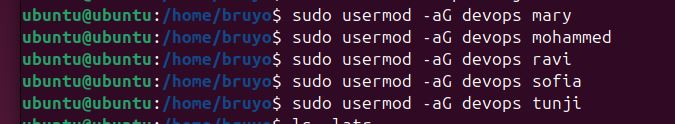
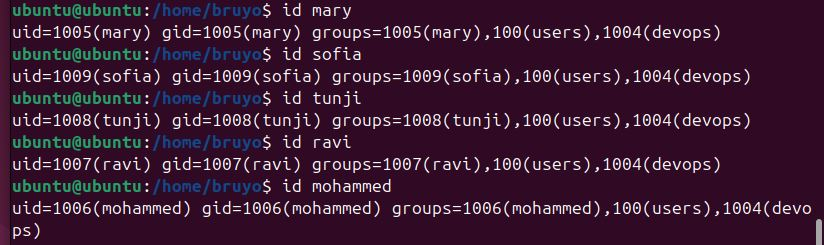

# Advance-Linux-Commands

# Project Preview

## File Permissions and Access Rights

This ensures security and integrity of a system which is crucial by giving authorized users access to both files and directory.

In Linux, file permission and ownership controls who can access, manipulate and execute files and directories.

# Project Task 3

## Stage 1: Create a group server called "devops"

'sudo groupadd devops'

## Stage 2: Create 5 Users ["mary", "mohammed", "ravi", "tunji" and "sofia"] and assigned to the devops group.

'sudo adduser mary'

'sudo adduser mohammed'

'sudo adduser ravi'

'sudo adduser tunji'

'sudo adduser sofia'

## Assigning the users to the devops group

'sudo chown :devops mary'

'sudo chown :devops mohammed'

'sudo chown :devops ravi'

'sudo chown :devops tunji'

'sudo chown :devops sofia'

## Stage 3: Create 5 folders for each Users in the home directory

'sudo mkdir mary'

'sudo mkdir mohammed'

'sudo mkdir ravi'

'sudo mkdir tunji'

'sudo mkdir sofia'

